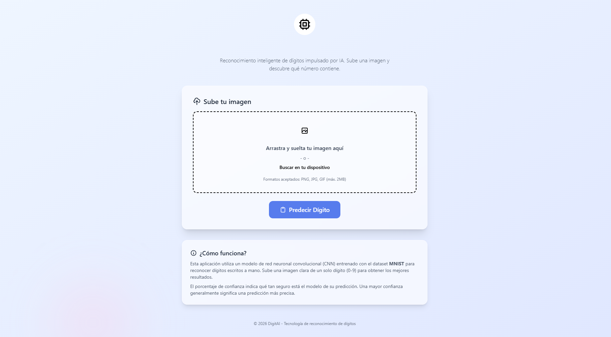
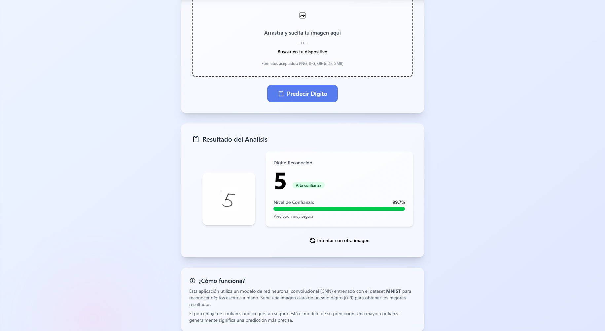

# Digit Prediction

Aplicación Web interactiva desarrollada con **Flask** y **Python** que utiliza un modelo de aprendizaje profundo (Redes Neuronales Convolucionales - CNN) para la predicción y clasificación de dígitos escritos a mano (0-9) basados en el dataset MNIST.

## 🤝 Colaboradores

- [@Diret03](https://github.com/Diret03/)
- [@Jordi021](https://github.com/Jordi021)

---

## 🖼️ Capturas de Pantalla

A continuación se muestra el funcionamiento de la aplicación:

### Carga de Imagen e Interfaz Principal


### Resultado de Predicción y Nivel de Confianza


---

## 🚀 Instalación y Configuración

### 1. Clonar el repositorio
```bash
git clone https://github.com/Diret03/DigitPrediction.git
cd DigitPrediction
```

### 2. Crear y activar el entorno virtual

* **Windows:**
  ```bash
  python -m venv .venv
  .venv\Scripts\activate
  ```

* **MacOS / Linux:**
  ```bash
  python3 -m venv .venv
  source .venv/bin/activate
  ```

### 3. Instalar dependencias de Python
```bash
pip install -r requirements.txt
```

### 4. (Opcional) Instalar dependencias de Tailwind CSS
```bash
npm install
```

---

## 💻 Cómo Ejecutar la Aplicación

1. Asegúrate de tener activado el entorno virtual (`.venv`).
2. Inicia el servidor de Flask ejecutando:
   ```bash
   python app.py
   ```
3. Abre tu navegador web e ingresa a:
   ```text
   http://127.0.0.1:5000/
   ```
4. Sube una imagen clara con un dígito (0-9) en formato PNG/JPG y haz clic en **Predecir** para ver el resultado y el porcentaje de precisión.
